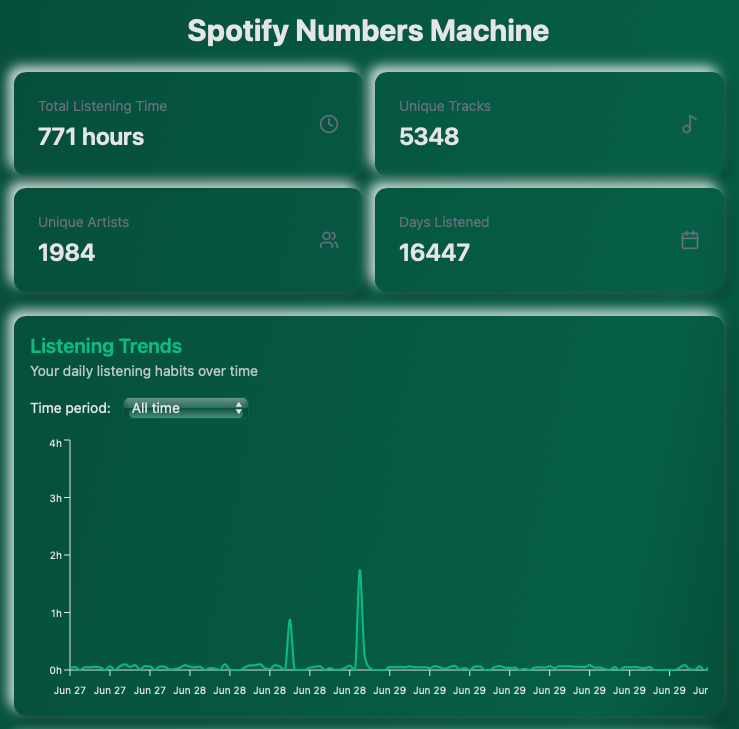

# Spotify Analytics Dashboard

[](https://opensource.org/licenses/MIT)
[](https://nodejs.org)
[](https://reactjs.org)
[](https://www.typescriptlang.org)
[](https://tailwindcss.com)
[](https://vitejs.dev)
[](https://github.com/MikeWayne92/musical-numbers-dashboard/pulls)
[](https://github.com/MikeWayne92/musical-numbers-dashboard/commits/main)





*Comprehensive visualization of Spotify listening habits*

## Overview

The Spotify Analytics Dashboard provides detailed visualizations of your personal listening data. Analyze your music preferences, discover listening patterns, and gain insights into your musical tastes—all in a privacy-focused, browser-based application.

## 🚀 Features

### Core Analytics
- **Comprehensive Overview**: Track total listening time, unique tracks/artists, and active days
- **Temporal Analysis**: Explore hourly, daily, and weekly listening patterns
- **Session Insights**: Analyze duration distribution and identify peak listening hours
- **Artist/Track Rankings**: View top 20 leaderboards with detailed play counts

### Advanced Visualizations
- Interactive time-series charts with brush zoom capability
- Heatmap displaying weekly listening distribution patterns
- Genre treemap with hierarchical breakdown of your music preferences
- Mood analysis radar chart (energy, valence, danceability)

### Data Management
- Secure browser-based processing with no cloud data transmission
- PDF export functionality with customizable report sections
- Responsive design optimized for both desktop and mobile devices

## 📦 Installation

### Prerequisites
- Node.js v16+ 
- npm v8+
- Git

### Local Setup
```bash
git clone https://github.com/MikeWayne92/musical-numbers-dashboard.git
cd musical-numbers-dashboard
npm install
npm run dev
```

### Production Build
```bash
npm run build
npm run preview
```

## 📊 Usage

### Data Preparation

#### Requesting Your Spotify Data
1. Navigate to [Spotify's Privacy Settings](https://www.spotify.com/account/privacy/)
2. Log in with your Spotify credentials if prompted
3. Scroll to the "Download your data" section
4. Click "Request" under "Extended streaming history"
5. Confirm your request via the email that Spotify sends you
6. Wait for Spotify to prepare your data (typically 3-5 business days)
7. Download the ZIP file from the link provided in the notification email

#### Extracting the Data Files
1. Unzip the downloaded archive to a folder on your computer
2. Locate the `MyData` folder containing `StreamingHistory*.json` files
3. These JSON files contain your detailed listening history and are ready for upload to the dashboard

### Dashboard Operations
1. Drag-and-drop JSON files into the upload zone
2. Use the date-range picker to filter your analysis period
3. Toggle between visualization modes using the control panel
4. Export PDF reports via the download button

## 🔧 Tech Stack

| Component | Technology | Purpose |
|-----------|------------|---------|
| Frontend Framework | React 18 | Component architecture |
| Type System | TypeScript 5 | Type safety & documentation |
| Styling | Tailwind CSS 3 | Utility-first CSS framework |
| Visualization | Recharts 2 | Interactive chart components |
| PDF Generation | jsPDF + html2canvas | Client-side report export |
| Build Tool | Vite 4 | Modern frontend toolchain |
| Hosting | Vercel | Static site deployment |

## 🔒 Data Privacy

- **Local Processing**: All analytics are computed client-side
- **No Tracking**: Zero analytics or telemetry collection
- **Ephemeral Storage**: Data persists only during your browser session
- **Secure Source**: Open-source codebase (MIT Licensed)

## 🤝 Contributing

### Development Workflow
1. Fork the repository
2. Create a feature branch (`git checkout -b feat/new-component`)
3. Commit your changes (`git commit -m 'Add new visualization'`)
4. Push to the branch (`git push origin feat/new-component`)
5. Open a Pull Request

### Reporting Issues
Use GitHub Issues with:
- Detailed reproduction steps
- Expected vs actual behavior description
- Browser and OS version details

## 📄 License

Distributed under MIT License. See `LICENSE` for the full text.

## 📬 Contact

- Michael Wayne
- [Project Repository](https://github.com/MikeWayne92/musical-numbers-dashboard)
- [Professional Inquiry](https://github.com/MikeWayne92)

## 🌟 Acknowledgments

- Spotify API team for their data accessibility
- Recharts community for visualization patterns
- Vercel for their static hosting infrastructure

*Note: Requires valid Spotify Extended Streaming History data for full functionality. Data typically available 3-5 days after request.*
